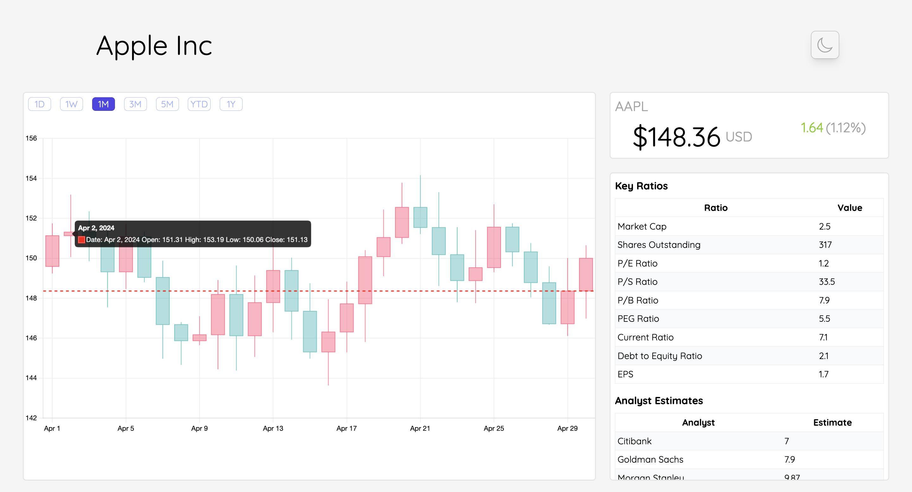
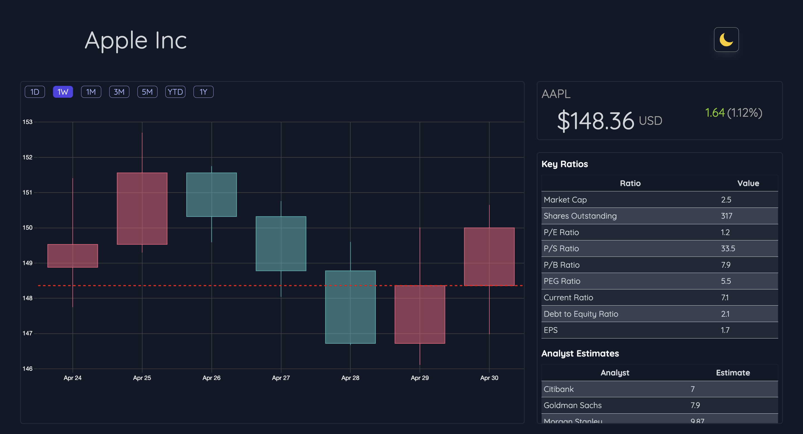

# Stock Dashboard

## Overview

The Stock Dashboard is a comprehensive tool designed for the everyday investor to monitor stock prices, perform equity research, and gain insights into market trends. The application provides detailed financial data, candlestick charts, and an overview of stock performance in a user-friendly interface.



## Features

- **Equity Research**: Simplified news, sentiment analysis, and detailed financial data.
- **Interactive Candlestick Charts**: Visual representation of daily and intraday stock data.
- **Responsive Design**: Optimized for both desktop and mobile views.
- **Dark Mode**: Seamlessly switch between light and dark themes.


- **Error Handling**: Robust error boundary components to ensure smooth user experience.

## Tech Stack

- **React**: A JavaScript library for building user interfaces.
- **TypeScript**: Superset of JavaScript that adds static types.
- **Chart.js**: Simple yet flexible JavaScript charting for designers & developers.
- **Tailwind CSS**: A utility-first CSS framework for rapidly building custom designs.
- **Vercel**: Platform for frontend frameworks and static sites, optimized for speed.

visit [Vercel's official website](https://stock-app-theta-bice.vercel.app/).
[Deployed Website](stock-app-theta-bice.vercel.app)


## Installation

1. **Clone the repository**:
    ```sh
    git clone git@github.com:Swapnil-Narendra-Patil/Stock-App.git
    cd stock-dashboard
    ```

2. **Install dependencies**:
    ```sh
    npm install
    ```

3. **Run the development server**:
    ```sh
    npm start
    ```

4. **Build for production**:
    ```sh
    npm run build
    ```

## Usage

- **View Stock Details**: View the latest stock prices, changes, and percentage changes.
- **Interactive Charts**: Analyze stock performance with interactive candlestick charts.

## Components

- **Dashboard**: The main component that renders the entire dashboard layout.
- **Card**: A reusable card component for displaying various sections of the dashboard.
- **FinancialTable**: Displays detailed financial data in a tabular format.
- **CandlestickChart**: Renders daily and intraday candlestick charts.
- **Header**: Displays the header with the company name.
- **Overview**: Shows an overview of the stock's latest performance.
- **ErrorBoundary**: Handles errors gracefully to ensure smooth user experience.


## Deployment

The Stock Dashboard is deployed on Vercel. To deploy your own version:

1. **Install Vercel CLI**:
    ```sh
    npm install -g vercel
    ```

2. **Deploy**:
    ```sh
    vercel
    ```

3. **Follow the prompts** to complete the deployment.

## Contributing

Contributions are welcome! Please feel free to submit a Pull Request.

## License

This project is licensed under the MIT License.

